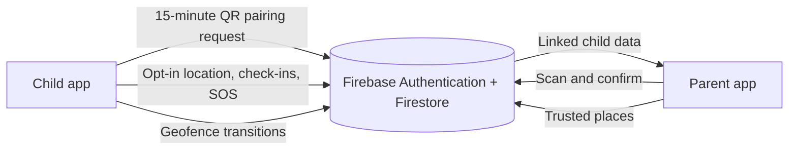

# SafeChildAI

SafeChildAI is an Android app for parent–child safety check-ins and location sharing. A parent and child connect by scanning a short-lived QR code. Once connected, the child can share their location, send a safe check-in or SOS, and the parent can view location history and configured trusted places.

> SafeChildAI is a project prototype. An SOS is an in-app event, not a call to emergency services. Location-based pattern alerts are prompts for a parent to review, not proof of danger.

## Contents

- [What it does](#what-it-does)
- [How it works](#how-it-works)
- [Location patterns](#location-patterns)
- [Technology](#technology)
- [Run the Android app](#run-the-android-app)
- [Configure Firebase](#configure-firebase)
- [Project layout](#project-layout)
- [Privacy and permissions](#privacy-and-permissions)
- [License](#license)

## What it does

### Parent or guardian

- Create an account with email and password.
- Connect a child by scanning the child’s pairing QR code.
- View connected children, their latest shared location, and location history on a map.
- Add, edit, enable, or disable trusted places and their geofence radii.
- Review safe check-ins, SOS events, and location-pattern review notifications.

### Child

- Set up a child profile and show a pairing QR code to a parent.
- Share location while sharing is enabled and the required Android permissions are granted.
- Send a safe check-in or manually confirmed SOS to the connected parent.
- Review location-sharing and privacy settings in the app.

Maps are rendered with OpenStreetMap data. The Android app does not need a Google Maps key.

## How it works

1. **Set up the parent.** The parent registers with Firebase Authentication and opens the child-connection screen.
2. **Prepare the child device.** The child starts a Firebase-authenticated session, enters a display name, and creates a pairing request. The app displays its request ID as a QR code. Requests expire after 15 minutes and can be used once.
3. **Connect the devices.** The parent scans the QR code with the in-app camera. The app checks that the Firestore request is still pending and unexpired, then creates the parent–child relationship and consumes the request. Firestore rules validate pairing and relationship operations and limit location and event access to account owners and linked family members.
4. **Share location.** The child enables sharing and grants location permissions. A foreground location service writes the latest location and timestamp to Firestore and appends history points. Updates are requested about once a minute; Android battery controls and network availability can delay them.
5. **Use safety features.** A child can send a safe check-in or confirm an SOS. The parent dashboard listens for events, displays them, and can resolve them. SOS notifications depend on the parent app being signed in, network access, and Android notification permission.
6. **Review trusted-place activity.** Enabled trusted places are registered as Android geofences. Entry and exit transitions are recorded for the parent to review.



## Location patterns

The parent app contains a per-child Isolation Forest model that reviews location-history patterns on the parent’s device. It considers approximate position and time-of-week features. Automatic fitting waits for at least 36 usable readings across at least 3 distinct days. A flagged pattern can appear as an AI review item and notification for the parent to assess.

This is a lightweight anomaly signal. It does not identify an emergency, diagnose behavior, or replace a parent’s judgment. SafeChildAI does not send these coordinates to a separate AI service.

## Technology

- Kotlin and Jetpack Compose
- AndroidX Navigation, CameraX, ML Kit barcode scanning, and ZXing QR generation
- Firebase Authentication, Cloud Firestore, and Firebase Cloud Functions dependencies
- Google Play location services for location updates and geofencing
- OpenStreetMap map tiles and attribution

The repository also contains callable child-access-code functions under `functions/`. The current app connection flow uses the QR/Firestore request flow described above; those callable functions are not required for that flow.

## Run the Android app

### Requirements

- Android Studio with an Android SDK that includes the compile SDK configured by this project
- Android 8.0 (API 26) or later for a device or emulator
- A Firebase project configured for the app (see below)

### Steps

1. Clone the repository and open its root folder in Android Studio:

   ```bash
   git clone --branch github-share https://github.com/imtiaz-ahmad-shah/SafeChildAI.git
   ```

2. Add your Firebase Android configuration at `app/google-services.json`. This file is intentionally excluded from the repository.
3. Let Android Studio sync Gradle, then run the `app` configuration on a device or emulator.
4. Grant camera permission to scan a child’s QR code. On the child device, grant location permissions if location sharing is needed. Background location availability depends on the Android version and the permission choice.

You can also build a debug APK from the project root:

```bash
./gradlew assembleDebug
```

On Windows, use `gradlew.bat assembleDebug`.

## Configure Firebase

1. Create a Firebase project and register an Android app with application ID `com.safechild.ai`.
2. Enable **Email/Password** and **Anonymous** sign-in providers in Firebase Authentication.
3. Create a Cloud Firestore database and review/deploy the rules in `firestore.rules` for that project.
4. Download that app’s `google-services.json` and save it to `app/google-services.json`.
5. Before deploying anything, check `.firebaserc` and make sure the Firebase project selected by the Firebase CLI is the intended project. The checked-in alias currently points to `safechild-ai`.

The callable functions in `functions/` are optional for the current QR connection flow. If you plan to deploy them, review their runtime and implementation for your Firebase project first. Never commit service-account credentials or private keys.

## Project layout

| Path | Purpose |
| --- | --- |
| `app/src/main/java/com/safechild/ai/` | Android app, screens, services, data access, and utilities |
| `app/src/main/res/` | App icons, themes, and Android resources |
| `functions/` | Firebase callable Cloud Functions |
| `firestore.rules` | Firestore access rules for profiles, relationships, locations, pairing, and safety events |
| `firebase.json` | Firebase CLI configuration |
| `gradle/` | Gradle wrapper and version catalog |

## Privacy and permissions

Location is sensitive. Location sharing is controlled from the child app and requires Android location permission. The foreground service shows an ongoing notification while tracking is active. Camera permission is used for the parent’s QR scanner; notification permission is used for parent-side alerts where required by Android.

Firestore rules are part of the security boundary. Review them and test your own Firebase configuration before using real family data. Do not put API keys, `google-services.json`, `local.properties`, or service-account files into commits. These local files are ignored by Git.

## License

No open-source license has been selected. Public visibility allows people to view and clone the repository, but it does not grant permission to reuse, modify, or redistribute the code. Ask the project owner before reusing it.
